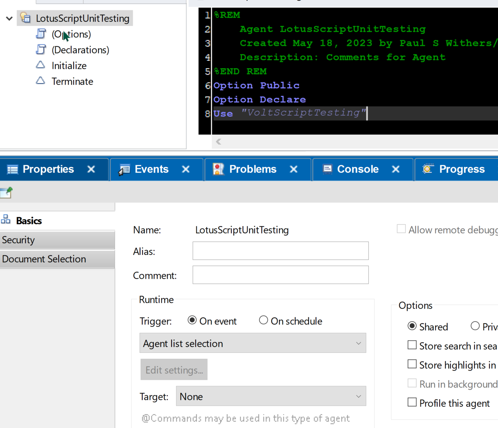

# Engage Demo - Unit Testing

## Setup Script Library and Agent

1. Copy VoltScriptTesting.bss into a Script Library, calling it "VoltScriptTesting".
1. Create an agent called "LotusScriptUnitTesting".
1. Set the "Trigger" to "Agent list selection".
1. Set the "Target" to "None".
1. In "Options" add `Use VoltScriptTesting`.

{ style="height:400px" }

## Person Class

The Person class will contain firstName, lastName, age and gender. But gender will only be settable via a Property, and the Property will ensure a valid value is passed, otherwise generate an error.

1. Add a class called "Person".
1. Add three public properties:
    - firstName as String
    - lastName as String
    - age as Integer
1. Add a private property, pgender as String.
1. Add a property get for gender:

    ```vbscript
    Property Get gender As String
		gender = Me.pgender
	End Property
    ```

1. Add a property set for gender:

    ```vbscript
    Property Set gender As String
		If (gender <> "Male" And gender <> "Female" And gender <> "Other") Then Error 1400, "Invalid gender: Must be 'Male', 'Female' or 'Other'"
		Me.pgender = gender
	End Property
    ```

## Test Successful Creation

This function will test creating a Person successfully, and validate the properties are as expected.

1. Create a function called "testBasic", `Function testBasic(testRunner As TestRunner) As Boolean`.
1. Declare a variable `p` as a new Person.
1. Declare a TestSuite called `testSuite` with the name "Testing Basic Success".
1. Add testSuite to the testRunner.
1. Add error handling to trigger `Call testSuite.addError("Error: " & Error & " on line " & Erl, Erl)`.
1. Add a test with the description "Test creating a person".
1. Set firstName, lastName, age and a valid gender for `p`.
1. Call `Call testSuite.addResult(True, "")`. If we get here, the test was successful.
1. Add a test with the description "Test p is a Person".
1. Add an assertion that `p` is a "PERSON".
1. Add a test to validate the Person's name.
1. Add a test to validate the Person's age.
1. Add a test to validate the Person's gender.
1. Exit the function by calling `testBasic = testSuite.ranSuccessfully()`.

??? example "Completed Function"
    ```vbscript
    Function testBasic(testRunner As BaliTestRunner) As Boolean

    	Dim p As New Person
	    Dim testSuite As New TestSuite("Testing Basic Success")
    	Call testRunner.addTestSuite(Testsuite)
    
	    On Error GoTo logErr
	
    	Call testSuite.describe("Test creating a person")
	    p.firstName = "Paul"
    	p.lastName = "Withers"
	    p.age = 21
    	p.gender = "Male"
	    Call testSuite.addResult(True, "")	'Successfully created a person
    	Call testSuite.describe("Test p is a Person").assertIs("PERSON", p)
	    Call testSuite.describe("Test name is Paul Withers").assertEqualsString("Paul Withers", p.firstName & " " & p.lastName, False)
    	Call testSuite.describe("Test age is 21").assertEqualsInteger(21, p.age)
	    Call testSuite.describe("Test gender is male").assertTrue(p.gender = "Male")
	
    	testBasic = testSuite.ranSuccessfully()
	Exit Function
	
    logErr:
	    Call testSuite.addError("Error: " & Error & " on line " & Erl, Erl)
	    Exit Function
    End Function
    ```

## Test Gender Validation

Testing success is insufficient for proper unit testing. We also need to unit test passing bad values.

1. Create a function called "testGenderValidation", `Function testGenderValidation(testRunner As TestRunner) As Boolean`.
1. Declare a variable `p` as a new Person.
1. Declare a TestSuite called `testSuite` with the name "Testing Basic Success".
1. Add testSuite to the testRunner.
1. Add error handling with a label name `mainErr` to trigger `Call testSuite.addError("Error: " & Error & " on line " & Erl, Erl)`, resuming next.
1. Add a test with the description "Test creating a person does not accept 'Mail'".
1. Set the firstName, lastName and age of `p`.
1. Add on `On Error` statement to goto a label called "testErr".
1. Add a `testErr` block after the main error block. In the error block:
    1. Call `Call testSuite.addResult(True, "")`.
    1. Call `Resume otherChecks`.
1. After the `On Error GoTo testErr`, set gender of `p` to "Mail".
1. Fail the test if it gets to this line with `Call testSuite.addResult(False, "Setting gender to Mail should error")`.
1. Add a label called `otherChecks`. We want to test all other properties after we passed the invalid gender.
1. Add another `On Error` statement to go to mainErr. If any other errors occur, we want to error the test.
1. Add a test with the description "Test p is a Person".
1. Add an assertion that `p` is a "PERSON".
1. Add a test to validate the Person's name.
1. Add a test to validate the Person's age.
1. Add a test to validate the Person's gender is not "Male".
1. Exit the function by calling `testGenderValidation = testSuite.ranSuccessfully()`.

??? example "Completed Function"
    ```vbscript
    Function testGenderValidation(testRunner As TestRunner) As Boolean

    	Dim p As New Person
	    Dim testSuite As New TestSuite("Testing Gender Validation")
    	Call testRunner.addTestSuite(Testsuite)
	
	    On Error GoTo mainErr
	
    	Call testSuite.describe("Test creating a person does not accept 'Mail'")
	    p.firstName = "Paul"
    	p.lastName = "Withers"
	    p.age = 21
	
    	On Error GoTo testErr
    
	    p.gender = "Mail"
    	Call testSuite.addResult(False, "Setting gender to Mail should error")	'Successfully created a person
	
    otherChecks:
	    On Error GoTo mainErr
    	Call testSuite.describe("Test p is a Person").assertIs("PERSON", p)
	    Call testSuite.describe("Test name is Paul Withers").assertEqualsString("Paul Withers", p.firstName & " " & p.lastName, False)
    	Call testSuite.describe("Test age is 21").assertEqualsInteger(21, p.age)
	    Call testSuite.describe("Test gender is not male").assertFalse(p.gender = "Male")
	
    	testGenderValidation = testSuite.ranSuccessfully()
	    Exit Function
	
    mainErr:
	    Call testSuite.addError("Error: " & Error & " on line " & Erl, Erl)
    	Resume Next
	
    testErr:
	    Call testSuite.addResult(True, "")
    	Resume otherChecks

    End Function
    ```

## Sub Initialize

1. Declare a variable `testRunner` with the name "Validating Person Class".
1. Declare a boolean variable called result.
1. Set `result` to the result of `testBasic`, passing the `testRunner` variable.
1. Set `result` to the result of `result` and `testGenderValidation`, passing the `testRunner` variable.
1. If `result` is true, print "All tests passed"

??? Completed code
    ```vbscript
    Dim testRunner As New TestRunner("Validating Person Class")
    Dim result As Boolean
    result = testBasic(testRunner)
    result = result And testGenderValidation(testRunner)
	
    If result Then Print "All test passed"
    ```

!!! success
    You have successfully created unit tests for the Person object. Test by running the agent. The output will be written to "unit-test-reports" directory under the Notes program directory.

[Full Code](../assets/example_code/LotusScriptUnitTests.lss)

!!! tip
    To test yourself further:

    1. Add unit tests for trying to pass a non-string value to `firstName` or `lastName`.
    1. Add a unit test for trying to pass a non-numeric value to age.
    1. An Integer can be a number that is not sensible for an age. Change age to a private variable and use a property to validate age is within reasonable bounds. Add tests for this.